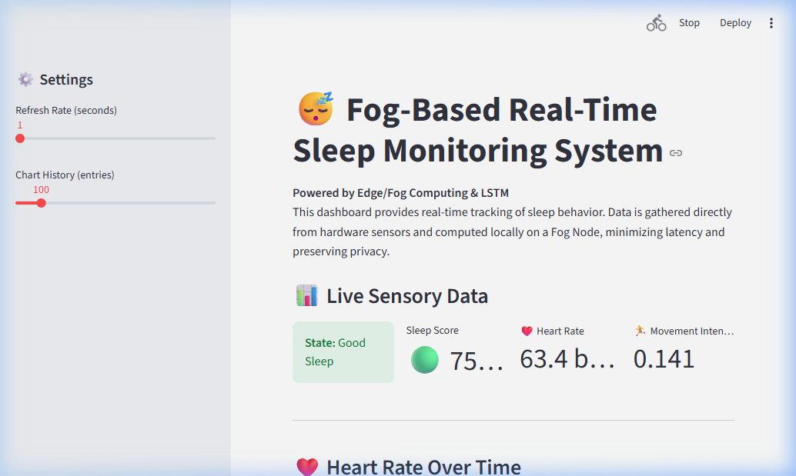

# 😴 Fog-Based Real-Time Sleep Quality Monitoring System

[](https://python.org)
[](https://tensorflow.org)
[](https://streamlit.io)
[-brightgreen.svg)](https://physionet.org/content/mmash/1.0.0/)
[](LICENSE)

A **Cyber-Physical System (CPS)** and **Machine Learning** project that provides **real-time, privacy-focused sleep quality estimation**. The system integrates wearable hardware sensors (PPG + Accelerometer) with a deep-learning LSTM network, processing physiological data locally via **Fog Computing** to deliver an interpretable sleep score from **0–100**.

> **Original Repository:** Forked and improved from [@guhya-16/FogSleepMonitor](https://github.com/guhya-16/FogSleepMonitor)

---

## 🚀 Project Overview

Traditional sleep monitoring often relies on cloud-based processing, leading to latency issues and privacy concerns. This project addresses these gaps with a **three-layer Fog Computing architecture**:

| Feature | Description |
|---------|-------------|
| 🔒 **Local Processing (Fog Node)** | Uses a laptop as a processing hub — **no data leaves your machine** |
| ⚡ **Real-Time Sensing** | Captures raw accelerometer + PPG data via Arduino at **10Hz** sampling rate |
| 🧠 **Deep Learning (LSTM)** | Processes 30-step sliding windows of physiological data for temporal pattern recognition |
| 📊 **Live Dashboard** | Streamlit-powered real-time visualization with sleep scores, HR trends, and alerts |
| 📦 **Real Dataset** | Trained on the **MMASH dataset** (PhysioNet) — 22 real human subjects, 1.4M data points |

---

## 📸 Live Dashboard Preview



> Real-time monitoring showing **Good Sleep** state at **75% sleep score**, heart rate **63.4 BPM**, and movement intensity **0.141** — all computed locally on the Fog Node.

---

## 🏗️ System Architecture

```
┌─────────────────────────────────────────────────────────────────────────┐
│                         CYBER / FOG LAYER                              │
│                                                                        │
│  ┌─────────────────┐   ┌──────────────────┐   ┌────────────────────┐  │
│  │  Preprocessing   │ → │   LSTM Model     │ → │  Streamlit         │  │
│  │  • Rolling HRV   │   │  (64→32 units)   │   │  Dashboard         │  │
│  │  • Movement Mag   │   │  30-step windows │   │  • Live Score      │  │
│  │  • Feature Eng.   │   │  → Score 0-100   │   │  • HR Charts       │  │
│  └─────────────────┘   └──────────────────┘   └────────────────────┘  │
└─────────────────────────────────────────────────────────────────────────┘
                                ↑
                      USB Serial (115200 baud)
                                ↑
┌─────────────────────────────────────────────────────────────────────────┐
│                        PHYSICAL LAYER                                   │
│                                                                         │
│     ┌───────────────────────────────────────────────────────────┐       │
│     │   Arduino UNO R3                                          │       │
│     │   ├── MPU-6050 Accelerometer (I2C: SDA/SCL)               │       │
│     │   └── PPG Pulse Sensor (Analog: A0)                       │       │
│     │                                                            │       │
│     │   Output: timestamp, AcX, AcY, AcZ, PulseValue           │       │
│     │   Rate: 10 samples/second (100ms interval)                │       │
│     └───────────────────────────────────────────────────────────┘       │
└─────────────────────────────────────────────────────────────────────────┘
```

**Data Flow:**
1. **Physical Layer** → Arduino reads raw accelerometer (XYZ) + heart rate (PPG) at 10Hz
2. **Communication** → Data sent via USB Serial (PySerial, 115200 baud) as CSV packets
3. **Fog Layer** → Python processes features in real-time, LSTM predicts sleep quality
4. **Dashboard** → Streamlit displays live metrics, charts, and sleep state classification

---

## 📊 Dataset: MMASH (PhysioNet)

We use the **Multilevel Monitoring of Activity and Sleep in Healthy People (MMASH)** dataset, a publicly available research dataset from PhysioNet.

| Property | Details |
|----------|---------|
| **Source** | [PhysioNet — MMASH v1.0.0](https://physionet.org/content/mmash/1.0.0/) |
| **Subjects** | 22 real human participants |
| **Total Data Points** | **1,394,316** sensor readings |
| **Sensors Used** | Actigraph (3-axis accelerometer + HR), HR Monitor (beat-to-beat RR intervals) |
| **Sleep Metrics** | Total Sleep Time, WASO, Sleep Efficiency, Fragmentation Index, Awakenings |
| **Sampling Rate** | 1 Hz (per-second readings) |
| **Format** | CSV files per subject |

### Why MMASH (Not WESAD)?

| Factor | WESAD ❌ | MMASH ✅ |
|--------|---------|---------|
| **Purpose** | Stress/emotion detection | **Sleep & activity monitoring** |
| **Context** | Lab test while awake | **24-hour monitoring including sleep** |
| **Matching Sensors** | 7+ modalities (ECG, EMG...) | **Accelerometer XYZ + HR** (matches our Arduino!) |
| **Sleep Quality Data** | None | ✅ TST, WASO, Efficiency, Fragmentation |
| **HRV** | Not directly available | ✅ **Beat-to-beat RR intervals** (computed RMSSD) |

### Sleep Score Formula

Our composite sleep score (0–100) is derived from clinical sleep metrics:

```
Score = (Efficiency × 0.40) + (WASO_penalty × 0.30) + (Awakening_penalty × 0.15) + (Fragmentation_penalty × 0.15)
```

| Component | Weight | Description |
|-----------|--------|-------------|
| Sleep Efficiency | 40% | Ratio of total sleep time to time in bed |
| WASO Penalty | 30% | Penalizes wake time relative to sleep time |
| Awakening Frequency | 15% | Penalizes frequent night awakenings |
| Sleep Fragmentation | 15% | Penalizes high movement/fragmentation index |

Each data point is further modulated by instantaneous movement intensity and heart rate deviation from resting baseline.

> **Citation:** Schmidt, P. & Reiss, A. (2018). MMASH Dataset. PhysioNet. https://doi.org/10.24432/C57K5T

---

## 🧠 Model Architecture & Results

### LSTM Architecture

```
Input (30 timesteps × 6 features)
    ↓
LSTM(64 units, return_sequences=True)
    ↓
Dropout(0.2)
    ↓
LSTM(32 units)
    ↓
Dropout(0.2)
    ↓
Dense(1, activation='linear')  →  Sleep Score (0-100)
```

### Feature Engineering Pipeline

| Feature | Source | Description |
|---------|--------|-------------|
| `movement_magnitude` | Accelerometer | `√(AcX² + AcY² + AcZ²)` — total movement intensity |
| `movement_variance` | Derived | Rolling variance (window=10) of movement magnitude |
| `avg_heart_rate` | PPG Sensor | Rolling average heart rate (window=10) |
| `hrv` | RR Intervals | Heart Rate Variability — RMSSD from beat-to-beat intervals |
| `movement_frequency` | Derived | Count of significant movements (>0.1) in rolling window |
| `sleep_duration` | Sleep Metrics | Total sleep duration in hours |

### 📈 Final Model Evaluation Scores

| Metric | Score | Description |
|--------|-------|-------------|
| **MSE** | 28.88 | Mean Squared Error |
| **RMSE** | 5.37 | Root Mean Squared Error (±5.37 points on 0-100) |
| **MAE** | **3.66** | Mean Absolute Error — average prediction off by ~3.7 points |
| **R² Score** | **0.6716** | Model explains 67.2% of sleep score variance |
| **Accuracy (±10 pts)** | **92.8%** ✅ | 93% of predictions within 10 points of truth |
| **Accuracy (±5 pts)** | **77.8%** ✅ | 78% of predictions within 5 points of truth |
| **Test Samples** | 19,994 | 20% holdout from 100K subsampled rows |

### Model Output
- **Score:** Continuous value from **0–100** (higher = better sleep quality)
- **Classification:** Binary — **Good Sleep** (≥ 70) / **Poor Sleep** (< 70)
- **Disturbance Detection:** Heuristic analysis explaining poor sleep episodes

---

## 📂 Project Structure

```
FogSleepMonitor/
├── 📁 data/                          # Dataset directory
│   └── MMASH/                        # Raw MMASH data (22 subjects, auto-downloaded)
├── 📁 dashboard/                     # Streamlit application
│   └── app.py                        # Real-time monitoring dashboard
├── 📁 fog_node/                      # Edge processing service
│   └── fog_service.py                # Data ingestion, feature extraction & LSTM inference
├── 📁 hardware/                      # Arduino firmware
│   └── arduino_code/
│       └── arduino_code.ino          # MPU6050 + PPG Pulse Sensor sketch
├── 📁 models/                        # Trained ML artifacts
│   ├── sleep_lstm_model.h5           # Trained Keras LSTM model (390 KB)
│   ├── scaler.pkl                    # MinMaxScaler (pickle)
│   └── model_metadata.pkl            # Training metrics + feature info (pickle)
├── 📄 config.py                      # Centralized configuration & constants
├── 📄 prepare_mmash_dataset.py       # MMASH dataset downloader & preprocessor
├── 📄 train_model.py                 # LSTM training pipeline
├── 📄 predict_realtime.py            # Standalone prediction diagnostic tool
├── 📄 requirements.txt               # Python dependencies
├── 📄 .gitignore                     # Git exclusion rules
└── 📄 README.md                      # This file
```

### Saved Model Artifacts (`models/`)

| File | Format | Contents |
|------|--------|----------|
| `sleep_lstm_model.h5` | HDF5 (Keras) | Trained LSTM network weights |
| `scaler.pkl` | Pickle | MinMaxScaler fitted on training features |
| `model_metadata.pkl` | Pickle | Scaler + feature names + evaluation metrics + dataset info |

---

## ⚙️ Installation & Setup

### Prerequisites
- **Python 3.9+**
- **Arduino IDE** (for flashing hardware firmware)
- **Arduino UNO R3** + MPU-6050 + PPG Pulse Sensor (for real hardware mode)

### 1. Clone the Repository

```bash
git clone https://github.com/GuruMohith24/FogSleepMonitor.git
cd FogSleepMonitor
```

### 2. Set Up Virtual Environment

```bash
python -m venv .venv

# Activate (Windows PowerShell):
.venv\Scripts\Activate.ps1

# Activate (Windows CMD):
.venv\Scripts\activate.bat

# Activate (Mac/Linux):
source .venv/bin/activate
```

### 3. Install Dependencies

```bash
pip install -r requirements.txt
```

### 4. Prepare Dataset & Train Model

```bash
# Step 1: Download MMASH and generate training CSV (downloads ~23MB from PhysioNet)
python prepare_mmash_dataset.py

# Step 2: Train the LSTM model (takes ~5-10 minutes on CPU)
python train_model.py
```

> **Note:** Pre-trained model files (`models/sleep_lstm_model.h5`, `models/scaler.pkl`) are included in the repo. You can skip Step 2 if you just want to run the system.

### 5. Hardware Setup (Optional)

Connect the sensors to your Arduino UNO:

| Sensor | Pin | Arduino Pin |
|--------|-----|-------------|
| PPG Pulse Sensor | Signal | A0 |
| PPG Pulse Sensor | VCC | 5V |
| PPG Pulse Sensor | GND | GND |
| MPU-6050 | SDA | A4 |
| MPU-6050 | SCL | A5 |
| MPU-6050 | VCC | 5V |
| MPU-6050 | GND | GND |

Flash `hardware/arduino_code/arduino_code.ino` using the Arduino IDE (baud rate: 115200).

---

## 📈 Usage

### Quick Test (No Hardware Needed)

```bash
# Run standalone prediction test with simulated data
python predict_realtime.py
```

**Expected Output:**
```
Sample  5/30: buffering...
Sample 10/30: buffering...
...
--- Final Prediction ---
  Sleep Score   : 68.8
  Classification: Poor Sleep
  Reason        : High movement or unstable HRV
```

### Full System (Fog Node + Dashboard)

**Terminal 1** — Start the Fog Processing Node:
```bash
python fog_node/fog_service.py
```
> If no Arduino is connected, it automatically falls back to a **mock sensor stream** for demo purposes.

**Terminal 2** — Start the Streamlit Dashboard:
```bash
streamlit run dashboard/app.py
```

Open **http://localhost:8501** in your browser to see the real-time monitoring interface.

### Configuration

All settings are in `config.py`:

| Setting | Default | Description |
|---------|---------|-------------|
| `SERIAL_PORT` | `COM3` | Arduino serial port (override with `SLEEP_SERIAL_PORT` env var) |
| `BAUD_RATE` | `115200` | Serial communication speed |
| `SEQ_LENGTH` | `30` | LSTM sliding window size (30 samples = 3 seconds at 10Hz) |
| `SAMPLING_RATE_HZ` | `10` | Sensor data polling frequency |

**Override serial port without editing code:**
```bash
# Windows
set SLEEP_SERIAL_PORT=COM5

# Linux/Mac
export SLEEP_SERIAL_PORT=/dev/ttyUSB0
```

---

## 🛠️ Tech Stack

| Category | Technologies |
|----------|-------------|
| **Hardware** | Arduino UNO R3, PPG Pulse Sensor, MPU-6050 Accelerometer |
| **Languages** | Python 3.9+, C++ (Arduino Sketch) |
| **ML Framework** | TensorFlow / Keras (LSTM) |
| **Data Processing** | NumPy, Pandas, Scikit-learn |
| **Visualization** | Streamlit (real-time dashboard) |
| **Communication** | PySerial (USB serial bridge) |
| **Serialization** | Joblib + Pickle (model artifacts) |

---

## 🔬 Why Fog Computing?

| Challenge | Our Solution |
|-----------|-------------|
| **Privacy Concerns** | All processing happens locally on your PC — no cloud uploads |
| **Latency Issues** | Edge computing eliminates cloud API round-trips (~0ms network latency) |
| **Noisy Sensor Data** | LSTM sliding windows provide temporal smoothing and noise suppression |
| **Interpretability** | Feature importance + heuristic disturbance explanations |
| **Cost** | Low-cost Arduino (~$5) + open-source Python stack |
| **Offline Capability** | Works without internet connection after model is trained |

---

## 🎯 Future Enhancements

- [ ] Multi-class sleep staging (REM, Deep, Light, Awake)
- [ ] SpO2 sensor integration for oxygen saturation monitoring
- [ ] XGBoost ensemble for comparison with LSTM
- [ ] Mobile app companion for remote night monitoring
- [ ] Cloud sync with end-to-end encryption for historical tracking
- [ ] Battery-powered portable Fog Node (Raspberry Pi)

---

## 👥 Contributors

| Name | Role | GitHub |
|------|------|--------|
| **Guru Mohith** | Lead Developer & ML Engineer | [@GuruMohith24](https://github.com/GuruMohith24) |
| **Guhya** | Initial Architecture & Hardware Integration | [@guhya-16](https://github.com/guhya-16) |

> **Original Repository:** [github.com/guhya-16/FogSleepMonitor](https://github.com/guhya-16/FogSleepMonitor)

---

## 📚 References

1. Schmidt, P. & Reiss, A. (2018). *MMASH — Multilevel Monitoring of Activity and Sleep in Healthy People* [Dataset]. PhysioNet. https://doi.org/10.24432/C57K5T
2. Goldberger, A. et al. (2000). *PhysioBank, PhysioToolkit, and PhysioNet: Components of a New Research Resource for Complex Physiologic Signals*. Circulation, 101(23).
3. Hochreiter, S. & Schmidhuber, J. (1997). *Long Short-Term Memory*. Neural Computation, 9(8), 1735–1780.

---

## 📄 License

This project is licensed under the MIT License — see the [LICENSE](LICENSE) file for details.

---

<p align="center">
  Made with ❤️ for better sleep quality monitoring<br>
  <sub>Powered by Fog Computing • LSTM • Real Physiological Data</sub>
</p>
